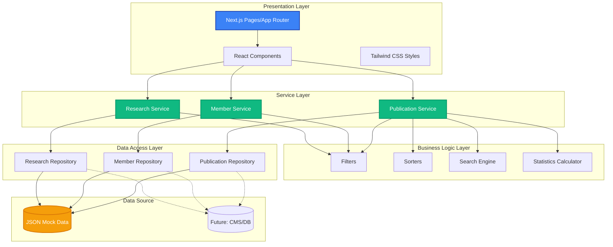
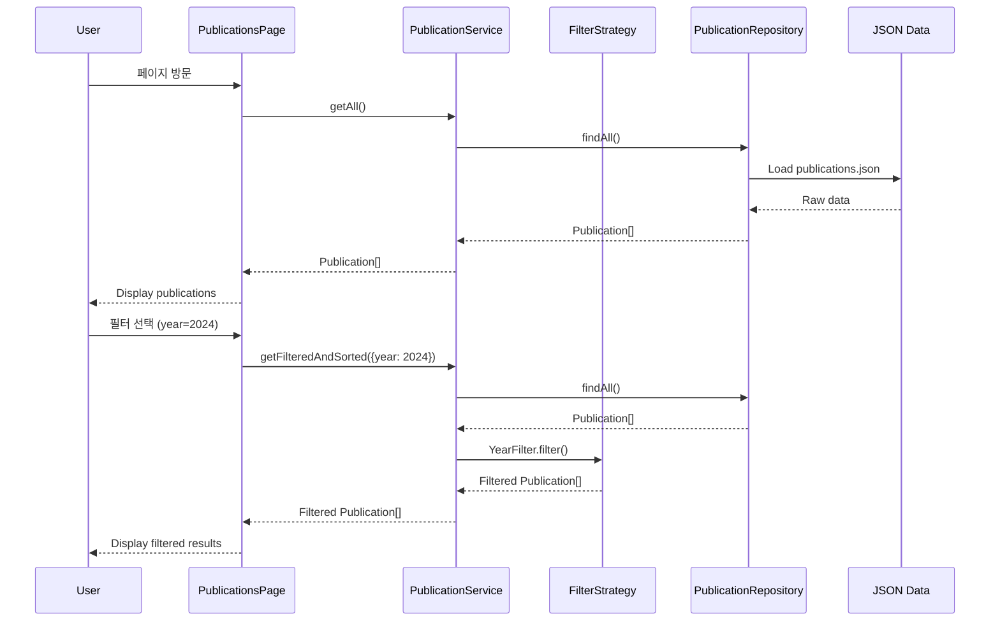
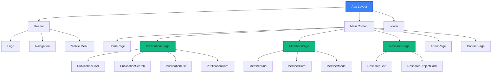
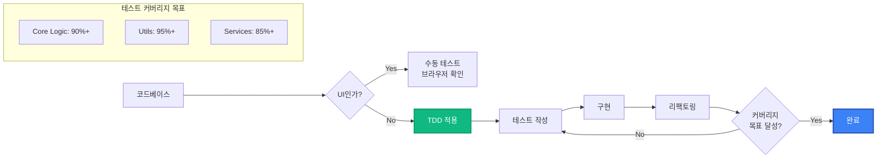

# 🎓 학술 연구실 홈페이지
> Academic Research Lab Official Website
> 
> [](https://github.com/minjae-488/lab-homepage/actions/workflows/deploy.yml)
> [](https://minjae-488.github.io/lab-homepage/)

[](https://nextjs.org/)
[](https://www.typescriptlang.org/)
[](https://tailwindcss.com/)
[](https://vitest.dev/)
[](LICENSE)

연구실의 전문성을 효과적으로 시각화하고, 연구 성과를 체계적으로 아카이빙하며, 잠재적인 연구원들에게 명확한 정보를 제공하는 프로페셔널한 웹사이트입니다.

---

## 📑 목차
- [주요 기능](#-주요-기능)
- [기술 스택](#-기술-스택)
- [아키텍처](#-아키텍처)
- [프로젝트 구조](#-프로젝트-구조)
- [시작하기](#-시작하기)
- [개발 가이드](#-개발-가이드)
- [테스트](#-테스트)
- [배포](#-배포)
- [개발 원칙](#-개발-원칙)
- [기여하기](#-기여하기)
- [라이선스](#-라이선스)

---

## ✨ 주요 기능

### 🏠 홈페이지
- 연구실 비전 및 슬로건 표시
- 주요 통계 (논문 수, 멤버 수, 프로젝트 수)
- 최신 연구 프로젝트 하이라이트
- 반응형 Hero Section

### 📚 Publications (논문 관리)
- **고급 필터링**: 연도별, 유형별 (Journal/Conference/Workshop) 필터
- **실시간 검색**: 제목, 저자, 키워드 기반 검색
- **정렬 기능**: 최신순, 과거순, 제목순
- **URL 공유**: 필터 상태를 URL 쿼리로 유지
- **통계 대시보드**: 연도별 발표 건수, 유형별 분포

### 👥 Members (멤버 관리)
- 역할별 그룹핑 (Professor, PhD, MS, Undergrad)
- 프로필 카드 with 연구 관심사
- 상세 정보 모달
- Alumni 섹션 (선택)

### 🔬 Research (연구 프로젝트)
- 진행 중 / 완료 프로젝트 구분
- 프로젝트 카드 with 이미지
- 연구 분야 소개
- 키워드 태그

### 👤 About (교수님 소개)
- 프로필 및 인사말
- 학력 타임라인
- 경력 타임라인
- 수상 경력

### 📧 Contact (연락처)
- 연구실 위치 정보
- 지도 임베드 (Google Maps / Naver Maps)
- 오시는 길 안내

---

## 🛠️ 기술 스택

### Frontend Framework
- **[Next.js 14+](https://nextjs.org/)** - React 프레임워크 (App Router)
- **[TypeScript](https://www.typescriptlang.org/)** - 타입 안정성
- **[React 18+](https://react.dev/)** - UI 라이브러리

### Styling
- **[Tailwind CSS](https://tailwindcss.com/)** - 유틸리티 기반 CSS
- **[Lucide React](https://lucide.dev/)** - 아이콘 라이브러리
- **[Shadcn UI](https://ui.shadcn.com/)** (선택) - 재사용 가능 컴포넌트

### Testing
- **[Vitest](https://vitest.dev/)** - 단위 테스트 프레임워크
- **[@testing-library/react](https://testing-library.com/)** - React 컴포넌트 테스트
- **[jsdom](https://github.com/jsdom/jsdom)** - DOM 환경 시뮬레이션

### Data Management
- **JSON Mock Data** - 초기 개발 단계
- *향후 계획*: CMS (Contentful, Sanity) 또는 Database 연동

### Development Tools
- **[ESLint](https://eslint.org/)** - 코드 품질 검사
- **[Prettier](https://prettier.io/)** - 코드 포맷팅
- **[date-fns](https://date-fns.org/)** - 날짜 유틸리티

### Deployment
- **[Vercel](https://vercel.com/)** - 프로덕션 배포 (권장)
- *대안*: GitHub Pages, Netlify

---

## 🏗️ 아키텍처

### 전체 시스템 아키텍처



### 레이어 상세 설명

#### 🎨 Presentation Layer (UI/UX)
- **역할**: 사용자 인터페이스 렌더링 및 사용자 입력 처리
- **구성 요소**:
  - Next.js Pages (App Router)
  - React Components (Layout, Common, Features)
  - Tailwind CSS 스타일링
- **특징**: 
  - Server Components와 Client Components 혼합 사용
  - SEO 최적화 (metadata, sitemap, robots.txt)

#### ⚙️ Service Layer (비즈니스 로직 조율)
- **역할**: 비즈니스 로직을 조율하고 데이터 흐름 관리
- **구성 요소**:
  - `PublicationService`: 논문 관련 비즈니스 로직
  - `MemberService`: 멤버 관련 비즈니스 로직
  - `ResearchService`: 연구 프로젝트 관련 비즈니스 로직
- **SOLID 원칙 적용**:
  - Dependency Injection으로 Repository 주입
  - 인터페이스 기반 설계

#### 🔧 Business Logic Layer (핵심 로직)
- **역할**: 재사용 가능한 순수 비즈니스 로직
- **구성 요소**:
  - **Filters**: Strategy Pattern으로 구현된 필터링 로직
  - **Sorters**: 정렬 알고리즘
  - **Search Engine**: 검색 로직
  - **Statistics Calculator**: 통계 계산
- **TDD로 개발**: 모든 함수가 테스트로 검증됨

#### 💾 Data Access Layer (데이터 접근)
- **역할**: 데이터 소스와의 인터페이스
- **구성 요소**:
  - `IPublicationRepository` 인터페이스
  - `IMemerRepository` 인터페이스
  - `IResearchRepository` 인터페이스
  - JSON 기반 구현체
- **확장 가능**: 인터페이스 기반이므로 CMS/DB로 쉽게 전환 가능

### 데이터 흐름 (Publications 예시)



### 컴포넌트 구조



### 테스트 전략



---

## 📁 프로젝트 구조

```
lab-homepage/
├── .agent/                      # AI Agent 설정
│   ├── rules/
│   │   ├── tdd.md              # TDD 개발 규칙
│   │   └── solid.md            # SOLID 원칙 규칙
│   └── workflows/              # 워크플로우 정의
│
├── public/                      # 정적 파일
│   ├── images/                 # 이미지 파일
│   │   ├── members/           # 멤버 프로필 이미지
│   │   └── research/          # 연구 프로젝트 이미지
│   └── favicon.ico            # 파비콘
│
├── src/
│   ├── app/                    # Next.js App Router
│   │   ├── layout.tsx         # Root Layout
│   │   ├── page.tsx           # Home Page
│   │   ├── about/
│   │   │   └── page.tsx       # About Page
│   │   ├── research/
│   │   │   └── page.tsx       # Research Page
│   │   ├── members/
│   │   │   └── page.tsx       # Members Page
│   │   ├── publications/
│   │   │   └── page.tsx       # Publications Page
│   │   └── contact/
│   │       └── page.tsx       # Contact Page
│   │
│   ├── components/             # React 컴포넌트
│   │   ├── layout/            # 레이아웃 컴포넌트
│   │   │   ├── Header.tsx
│   │   │   ├── Navigation.tsx
│   │   │   └── Footer.tsx
│   │   ├── common/            # 공통 컴포넌트
│   │   │   ├── Button.tsx
│   │   │   ├── Card.tsx
│   │   │   ├── Badge.tsx
│   │   │   ├── Input.tsx
│   │   │   └── Modal.tsx
│   │   └── features/          # Feature 컴포넌트
│   │       ├── publications/
│   │       │   ├── PublicationCard.tsx
│   │       │   ├── PublicationFilter.tsx
│   │       │   ├── PublicationSearch.tsx
│   │       │   └── PublicationList.tsx
│   │       ├── members/
│   │       │   ├── MemberCard.tsx
│   │       │   └── MemberGrid.tsx
│   │       └── research/
│   │           ├── ResearchProjectCard.tsx
│   │           └── ResearchGrid.tsx
│   │
│   ├── lib/                    # 코어 로직 (TDD 적용)
│   │   ├── filters/           # 필터링 로직
│   │   │   ├── publicationFilters.ts
│   │   │   ├── publicationFilters.test.ts
│   │   │   ├── memberFilters.ts
│   │   │   └── memberFilters.test.ts
│   │   ├── sorters/           # 정렬 로직
│   │   │   ├── publicationSorters.ts
│   │   │   ├── publicationSorters.test.ts
│   │   │   ├── memberSorters.ts
│   │   │   └── memberSorters.test.ts
│   │   ├── search/            # 검색 로직
│   │   │   ├── publicationSearch.ts
│   │   │   └── publicationSearch.test.ts
│   │   ├── statistics/        # 통계 계산
│   │   │   ├── publicationStats.ts
│   │   │   ├── publicationStats.test.ts
│   │   │   ├── memberStats.ts
│   │   │   └── memberStats.test.ts
│   │   └── utils/             # 유틸리티 함수
│   │       ├── dateFormatter.ts
│   │       ├── dateFormatter.test.ts
│   │       ├── stringUtils.ts
│   │       ├── stringUtils.test.ts
│   │       ├── validators.ts
│   │       └── validators.test.ts
│   │
│   ├── services/               # 비즈니스 로직 서비스
│   │   ├── publicationService.ts
│   │   ├── publicationService.test.ts
│   │   ├── memberService.ts
│   │   ├── memberService.test.ts
│   │   ├── researchService.ts
│   │   └── researchService.test.ts
│   │
│   ├── repositories/           # 데이터 접근 레이어
│   │   ├── publicationRepository.ts
│   │   ├── publicationRepository.test.ts
│   │   ├── memberRepository.ts
│   │   ├── memberRepository.test.ts
│   │   ├── researchRepository.ts
│   │   └── researchRepository.test.ts
│   │
│   ├── types/                  # TypeScript 타입 정의
│   │   ├── publication.ts
│   │   ├── member.ts
│   │   ├── research.ts
│   │   ├── professor.ts
│   │   ├── contact.ts
│   │   └── index.ts           # Barrel export
│   │
│   ├── data/                   # Mock 데이터
│   │   ├── publications.json
│   │   ├── members.json
│   │   ├── research.json
│   │   ├── professor.json
│   │   └── contact.json
│   │
│   └── styles/                 # 전역 스타일
│       └── globals.css
│
├── PRD.md                      # 제품 요구사항 정의서
├── TASKS.md                    # 작업 목록
├── TASKS_DETAILED.md           # 상세 작업 목록
├── README.md                   # 이 문서
├── package.json
├── tsconfig.json
├── tailwind.config.ts
├── vitest.config.ts
├── next.config.js
└── .gitignore
```

---

## 🚀 시작하기

### 사전 요구사항

- **Node.js**: 18.17 이상
- **npm** 또는 **yarn** 또는 **pnpm**

### 설치

1. **저장소 클론**
   ```bash
   git clone https://github.com/your-username/lab-homepage.git
   cd lab-homepage
   ```

2. **의존성 설치**
   ```bash
   npm install
   # 또는
   yarn install
   # 또는
   pnpm install
   ```

3. **개발 서버 실행**
   ```bash
   npm run dev
   # 또는
   yarn dev
   # 또는
   pnpm dev
   ```

4. **브라우저에서 확인**
   ```
   http://localhost:3000
   ```

---

## 💻 개발 가이드

### 사용 가능한 스크립트

```bash
# 개발 서버 실행
npm run dev

# 프로덕션 빌드
npm run build

# 프로덕션 서버 실행
npm start

# 린트 체크
npm run lint

# 코드 포맷팅
npm run format

# 테스트 실행
npm test

# 테스트 (watch 모드)
npm run test:watch

# 테스트 UI
npm run test:ui

# 테스트 커버리지
npm run test:coverage
```

### 개발 워크플로우

#### 1. 새로운 기능 개발 (TDD)

**코어 로직 개발 시 (필수 TDD)**

```bash
# 1. 테스트 파일 작성
src/lib/filters/newFilter.test.ts

# 2. 테스트 실행 (실패 확인 - Red)
npm test

# 3. 구현 (테스트 통과 - Green)
src/lib/filters/newFilter.ts

# 4. 리팩토링 (테스트 유지 - Refactor)
npm test

# 5. 커버리지 확인
npm run test:coverage
```

**UI 컴포넌트 개발 시 (TDD 제외)**

```bash
# 1. 컴포넌트 작성
src/components/features/NewComponent.tsx

# 2. 브라우저에서 확인
npm run dev

# 3. 스타일 조정 및 반응형 테스트
```

#### 2. Git 커밋 가이드

```bash
# 1. 변경사항 스테이징
git add .

# 2. 커밋 (Conventional Commits)
git commit -m "feat: add publication filtering feature"
git commit -m "fix: resolve search bug in publications page"
git commit -m "test: add tests for publication filters"
git commit -m "docs: update README architecture section"

# 3. 푸시
git push origin main
```

### 코딩 스타일 가이드

#### TypeScript/React

```typescript
// ✅ Good: 명시적 타입, 함수형 컴포넌트
interface PublicationCardProps {
  publication: Publication;
  onClick?: () => void;
}

export function PublicationCard({ publication, onClick }: PublicationCardProps) {
  return (
    <div className="card">
      <h3>{publication.title}</h3>
    </div>
  );
}

// ✅ Good: 순수 함수, TDD
export function filterByYear(publications: Publication[], year: number): Publication[] {
  return publications.filter(pub => pub.year === year);
}
```

#### Tailwind CSS

```tsx
// ✅ Good: Utility-first, 반응형
<div className="flex flex-col md:flex-row gap-4 p-6 bg-white rounded-lg shadow-md hover:shadow-lg transition-shadow">
  <h2 className="text-2xl font-bold text-gray-900">Title</h2>
</div>

// ❌ Bad: Inline styles
<div style={{ display: 'flex', padding: '24px' }}>
```

---

## 🧪 테스트

### 테스트 전략

이 프로젝트는 **TDD (Test-Driven Development)** 방식을 따릅니다.

#### TDD 적용 대상
- ✅ 데이터 처리 로직 (필터, 정렬, 검색)
- ✅ 비즈니스 로직 (통계 계산, 데이터 변환)
- ✅ 유틸리티 함수
- ✅ Repository Layer
- ✅ Service Layer

#### TDD 제외 대상
- ❌ UI 컴포넌트 (시각적 확인)
- ❌ 스타일링
- ❌ 애니메이션

### 테스트 실행

```bash
# 모든 테스트 실행
npm test

# 특정 파일만 테스트
npm test publicationFilters

# Watch 모드 (개발 중)
npm run test:watch

# UI 모드 (브라우저에서 확인)
npm run test:ui

# 커버리지 리포트
npm run test:coverage
```

### 테스트 커버리지 목표

| 레이어 | 목표 커버리지 | 현재 상태 |
|--------|--------------|-----------|
| Core Logic (lib/) | 90% 이상 | - |
| Utils | 95% 이상 | - |
| Services | 85% 이상 | - |
| Repositories | 90% 이상 | - |
| **전체** | **85% 이상** | - |

### 테스트 예시

```typescript
// src/lib/filters/publicationFilters.test.ts
import { describe, it, expect } from 'vitest';
import { YearFilter } from './publicationFilters';

describe('YearFilter', () => {
  const mockPublications = [
    { id: '1', title: 'Paper A', year: 2024 },
    { id: '2', title: 'Paper B', year: 2023 },
  ];

  it('should filter publications by year', () => {
    const filter = new YearFilter(2024);
    const result = filter.filter(mockPublications);
    
    expect(result).toHaveLength(1);
    expect(result[0].id).toBe('1');
  });

  it('should return empty array when no match', () => {
    const filter = new YearFilter(2022);
    const result = filter.filter(mockPublications);
    
    expect(result).toHaveLength(0);
  });
});
```

---

## 🚢 배포

### Vercel 배포 (권장)

1. **Vercel 계정 생성 및 GitHub 연결**
   ```bash
   # Vercel CLI 설치 (선택)
   npm install -g vercel
   ```

2. **배포 설정**
   - Vercel 대시보드에서 "New Project" 클릭
   - GitHub 저장소 연결
   - Framework Preset: Next.js 자동 감지
   - Root Directory: `./`
   - Build Command: `npm run build`
   - Output Directory: `.next`

3. **자동 배포**
   ```bash
   # main 브랜치에 푸시하면 자동 배포
   git push origin main
   ```

4. **커스텀 도메인 설정** (선택)
   - Vercel 대시보드 > Settings > Domains
   - 도메인 추가 및 DNS 설정

### 수동 빌드 및 배포

```bash
# 프로덕션 빌드
npm run build

# 빌드 결과 테스트
npm start

# 정적 export (필요 시)
npm run export
```

### 배포 전 체크리스트

- [ ] 모든 테스트 통과 (`npm test`)
- [ ] 린트 에러 없음 (`npm run lint`)
- [ ] 프로덕션 빌드 성공 (`npm run build`)
- [ ] Lighthouse 점수 확인
  - Performance: 90점 이상
  - Accessibility: 95점 이상
  - Best Practices: 90점 이상
  - SEO: 95점 이상
- [ ] 크로스 브라우저 테스트 (Chrome, Firefox, Safari, Edge)
- [ ] 모바일 반응형 테스트
- [ ] SEO 메타데이터 확인

---

## 📐 개발 원칙

### 1. TDD (Test-Driven Development)

모든 코어 로직은 **테스트 우선** 방식으로 개발합니다.

```
Red (실패하는 테스트 작성)
  ↓
Green (테스트를 통과하는 최소 코드)
  ↓
Refactor (코드 개선)
  ↓
반복
```

자세한 내용: [.agent/rules/tdd.md](.agent/rules/tdd.md)

### 2. SOLID 원칙

객체지향 설계의 5가지 원칙을 준수합니다.

- **S**ingle Responsibility: 단일 책임
- **O**pen/Closed: 확장에 열림, 수정에 닫힘
- **L**iskov Substitution: 자식은 부모를 대체 가능
- **I**nterface Segregation: 작은 인터페이스로 분리
- **D**ependency Inversion: 추상화에 의존

자세한 내용: [.agent/rules/solid.md](.agent/rules/solid.md)

### 3. 코드 품질

- **ESLint**: 코드 품질 자동 검사
- **Prettier**: 일관된 코드 포맷
- **TypeScript Strict Mode**: 타입 안정성 최대화
- **Code Review**: Pull Request 필수

---

## 🤝 기여하기

### 기여 프로세스

1. **Fork** 저장소
2. **Feature Branch** 생성 (`git checkout -b feature/amazing-feature`)
3. **TDD** 적용하여 개발 (코어 로직만)
4. **테스트** 통과 확인 (`npm test`)
5. **Commit** (`git commit -m 'feat: add amazing feature'`)
6. **Push** (`git push origin feature/amazing-feature`)
7. **Pull Request** 생성

### Commit 메시지 규칙 (Conventional Commits)

```
feat: 새로운 기능 추가
fix: 버그 수정
docs: 문서 변경
style: 코드 포맷팅 (기능 변경 없음)
refactor: 코드 리팩토링
test: 테스트 추가/수정
chore: 빌드 설정 등 기타 변경
```

### 코드 리뷰 체크리스트

- [ ] TDD 규칙 준수 (코어 로직)
- [ ] SOLID 원칙 준수
- [ ] 테스트 커버리지 목표 달성
- [ ] ESLint 에러 없음
- [ ] TypeScript 타입 에러 없음
- [ ] 반응형 디자인 적용
- [ ] 접근성 (a11y) 고려

---

## 📄 관련 문서

- [PRD.md](PRD.md) - 제품 요구사항 정의서
- [TASKS.md](TASKS.md) - 작업 목록
- [TASKS_DETAILED.md](TASKS_DETAILED.md) - 상세 작업 목록
- [.agent/rules/tdd.md](.agent/rules/tdd.md) - TDD 개발 규칙
- [.agent/rules/solid.md](.agent/rules/solid.md) - SOLID 원칙 규칙

---

## 🎯 로드맵

### Phase 1 - MVP (진행 중)
- [x] 프로젝트 계획 수립
- [x] 개발 규칙 설정
- [ ] Next.js 프로젝트 초기화
- [ ] 기본 페이지 구현
- [ ] 배포

### Phase 2 - 기능 개선
- [ ] CMS 연동 (Contentful / Sanity)
- [ ] Admin Dashboard
- [ ] 다국어 지원 (한/영)
- [ ] Dark Mode

### Phase 3 - 고도화
- [ ] Analytics 연동
- [ ] Google Scholar 연동
- [ ] 논문 자동 임포트
- [ ] 검색 엔진 최적화 심화

---

## 🐛 버그 제보 및 문의

Issues를 통해 버그 제보 또는 기능 제안을 해주세요.

- [GitHub Issues](https://github.com/your-username/lab-homepage/issues)
- Email: lab@university.ac.kr

---

## 📜 라이선스

이 프로젝트는 [MIT License](LICENSE) 하에 배포됩니다.

---

## 👥 제작

- **개발**: [교수님 성함] 연구실
- **기술 스택**: Next.js, TypeScript, Tailwind CSS
- **개발 방식**: TDD + SOLID 원칙

---

## 🙏 Acknowledgments

- [Next.js](https://nextjs.org/) - React Framework
- [Tailwind CSS](https://tailwindcss.com/) - CSS Framework
- [Shadcn UI](https://ui.shadcn.com/) - Component Library
- [Vitest](https://vitest.dev/) - Testing Framework
- [Lucide](https://lucide.dev/) - Icon Library

---

<div align="center">

**Made with ❤️ for Academic Research**

[⬆ Back to top](#-학술-연구실-홈페이지)

</div>
